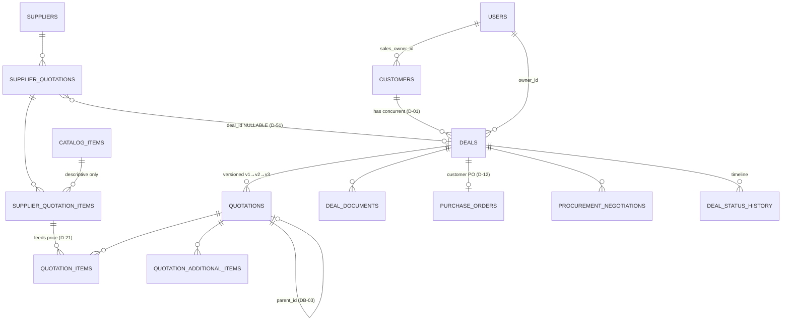

# Database Design

Derived from the specifications — **this file is not a source.** Where it and
`docs/CRM_Documentation_EN.md` disagree, the specification wins and this file is
the defect.

Its purpose is to hold the whole schema in one place before migrations are
written, which is step 2 of the module template in `MVP_Build_Plan_EN.md §1`
("Table and relationship design", before "Migration").

## What changed on 2026-08-19

A review against the specifications found eight defects in this file and one
between two authoritative documents. All are resolved below:

| Was | Now |
|---|---|
| No numeric precision anywhere — `NUMERIC(12,2)` would silently truncate `1021.263012` and break `D-06` | Precision table in section 1 · **Q-8** |
| `quotation_items` had no link to the supplier line that priced it, leaving `§10.3` unimplementable | `supplier_quotation_item_id NOT NULL` · section 10 |
| `DB-06`'s money quartet stored nowhere | `fx_rate_at_time` and `supplier_currency` added to `quotation_items` |
| `DB-03` says reports version by `parent_id`; the build plan names a `report_versions` table | Precedence resolves it — section 11 |
| `files` carried both `id` and `uuid` | The storage filename **is** `id` |
| No indexes at all, in a system where every query is row-scoped | Section 13 |
| Document codes had no concurrency-safe generator | Section 12 |
| `Q-6` asked about deal statuses only, of six status columns | Widened to one policy question |
| Foreign keys drawn in the entity map but named in no table | Added across section 11 |

Two tables also moved: `quotation_additional_items` is designed rather than
deferred, and `report_versions` is gone.

## How to read the markings

| Mark | Meaning |
|---|---|
| 📗 | **Documented.** Columns come from a named specification section. |
| 📙 | **Inferred.** The specification names the table but not its columns. These are proposals — **each needs approval before it is built**, per Change Discipline. |

The specifications name **32 tables** — 30 across the build plan's module lists,
plus `files` (`§17`) and `audit_log` (`§14.8`). Eleven now have documented
columns; the rest are inferred. That gap is the single most useful thing this
document surfaces: it is a list of decisions nobody has made yet.

---

## 1. Rules that apply to every business table

From `§4.8`. These are not optional and not per-table.

| # | Rule |
|---|---|
| `DB-01` | Soft delete — **no physical `DELETE`** |
| `DB-02` | Audit columns: `created_by` · `created_at` · `updated_by` · `updated_at` |
| `DB-03` | Versioning via `parent_id` + `version` (quotations and reports) |
| `DB-04` | Foreign keys and constraints enforced **at the database level** |
| `DB-05` | Enum tables, never hard-coded enums |
| `DB-06` | Money carries `amount` · `currency` · `fx_rate_at_time` · `base_amount` |
| `DB-07` | **`Decimal`/NUMERIC for money — `Float` forbidden** |
| `DB-08` | Timestamps stored UTC, displayed in user time |
| `DB-09` | Indexes on: customer · owner · deal status · dates · entity codes |
| `DB-10` | Partitioning for high-volume tables: audit · notifications |
| `DB-11` | Transactions for any operation touching more than one table |
| `DB-12` | **Optimistic locking on quotations** |
| `DB-13` | Fully managed migrations — no manual schema edits |

**Infrastructure tables are exempt.** `cache`, `cache_locks`, `jobs`,
`job_batches`, `failed_jobs`, `sessions`, `migrations` are Laravel's plumbing —
soft-deleting a cache row is meaningless. `DB-01`/`DB-02` apply to business
tables only.

### The standard column block

Every business table carries these unless stated otherwise:

```sql
id           UUID PRIMARY KEY         -- D-61, time-ordered (Str::orderedUuid)
created_by   UUID REFERENCES users(id)
created_at   TIMESTAMPTZ NOT NULL
updated_by   UUID REFERENCES users(id)
updated_at   TIMESTAMPTZ NOT NULL
deleted_at   TIMESTAMPTZ NULL         -- DB-01
```

### Numeric precision 📙 — needs approval before the Module 7 migration

`DB-07` says `Decimal`, never `Float`. It does not say *how many digits*, and
that omission is a live defect rather than a detail: `D-06` forbids rounding an
intermediate value, and `D-65` allows rounding to be switched off entirely, so
the stored value has to survive at full working precision. On PO #226 the tax
computes to `1021.263012` — six decimal places. A `NUMERIC(12,2)` column
truncates that to `1021.26` **silently**, with no database error, which is
exactly the intermediate rounding `D-06` exists to prevent.

| Kind | Type | Why |
|---|---|---|
| Money (`unit_cost`, `line_total`, `subtotal`, `tax_amount`, `final_total`, …) | `NUMERIC(18,6)` | Twelve integer digits covers any realistic total; six decimals sit four orders below the smallest configured rounding unit (`0.01`) |
| FX rate (`fx_rate_at_time`) | `NUMERIC(18,8)` | Rates are quoted far below currency precision and multiply into every line |
| Percentage (`margin_percent`, `discount_percent`, `tax_percent`) | `NUMERIC(6,3)` | `14.000`, `20.500`; three decimals is more than the UI offers |
| Quantity | `NUMERIC(14,4)` | Units include metre and kilo (`§7.3`), so quantity is not an integer |

**The trade-off, stated plainly:** persistence at scale 6 is itself a
quantization. `unit_cost_base = unit_cost × fx_rate_at_time` can produce more
than six decimals, and storing it quantizes the result. That is acceptable only
because the discarded magnitude is below `0.000001` of a currency unit and can
never move a final total — but it is a documented quantization, not an accident.
Arithmetic runs in BCMath at higher precision; only the persisted snapshot is at
scale 6.

**Approve or change these numbers before the first money migration.** Widening a
`NUMERIC` later is cheap; discovering that six months of quotations were stored
truncated is not.

---

## 2. Core entity map 📗

From `§4.1`. This is the shape the whole system hangs off.

> **Full diagram:** [`ERD.drawio`](ERD.drawio) — all 31 tables with columns, keys and
> relationships, editable at [diagrams.net](https://app.diagrams.net). [`ERD.svg`](ERD.svg) is the
> rendered view for reading without an editor. Both are generated from the tables
> below, so **this file stays the source and the diagram follows it** — if they
> disagree, regenerate rather than hand-editing the diagram.

The mermaid map below is the abbreviated version, kept inline because it renders
in Obsidian and on GitHub without leaving the page.



Three relationships carry documented weight and are easy to get wrong:

- **`SUPPLIER_QUOTATIONS.deal_id` is nullable** (`D-51`). A supplier offer is a
  standalone, reusable entity. Making it required breaks the module.
- **Prices live on `SUPPLIER_QUOTATION_ITEMS`, never on `CATALOG_ITEMS`**
  (`D-21`). The catalog is descriptive.
- **`QUOTATIONS.parent_id` self-reference** (`DB-03`, `D-08`). Partial, Counter
  and Returned each create a **full copy**, not an in-place edit.

---

## 3. Module 0 — Foundation

### `files` 📙 · `§17`

Documented: 10 MB configurable limit (`D-39`), allowed types PDF/JPG/PNG/WEBP/
DOCX/XLSX (`D-40`), true MIME validation, virus scan, UUID naming with the
original name kept in the database, path
`/{year}/{month}/{entity_type}/{entity_id}/{uuid}.ext` outside the web root,
permission inherited from the parent entity (`D-38`).

| Column | Type | Note |
|---|---|---|
| `original_name` | VARCHAR | 📗 kept for display |
| `entity_type` | VARCHAR | 📙 polymorphic parent |
| `entity_id` | UUID | 📙 |
| `mime_type` | VARCHAR | 📗 true type, not extension |
| `size_bytes` | BIGINT | 📗 |
| `storage_path` | VARCHAR | 📗 |
| `scan_status` | VARCHAR | 📙 pending/clean/infected — `SEC-15` |
| `scanned_at` | TIMESTAMPTZ | 📙 |

> **The storage filename is `id`, not a second column.** `§17` writes the path as
> `…/{entity_id}/{uuid}.ext`, and `D-61` already makes `id` a UUID — so the `{uuid}`
> in that path *is* `files.id`. A separate `uuid` column would store the same
> value twice and invite the two to drift apart. `storage_path` holds the
> assembled path.

**Indexes:** `(entity_type, entity_id)` — every permission check loads a
parent's attachments (`D-38`) · `scan_status` where it is not `clean`, for the
quarantine view · `created_at` for the orphan-cleanup job `J-11`.

> **Open:** the parent link is polymorphic here because attachments hang off
> deals, supplier quotations, purchase orders, reports and visits. The
> specification does not say how. See Q-2.

### `audit_log` 📗 · `§14.8`

Columns are documented: user · event · entity · old value · new value ·
timestamp · IP · device, plus correlation ID from `Coding_Standards §10`.

| Column | Type | Note |
|---|---|---|
| `user_id` | UUID | actor (D-61) |
| `event` | VARCHAR | `SELF_APPROVAL`, `LOGIN_AS`, … (`§3.12` rule 4) |
| `entity_type` · `entity_id` | VARCHAR · UUID | subject (D-61) |
| `old_values` · `new_values` | JSONB | |
| `ip_address` · `device` | INET · VARCHAR | |
| `request_id` · `correlation_id` | VARCHAR | |
| `created_at` | TIMESTAMPTZ | |

> **Immutable and retained permanently** (`D-30`, `AUD-03`). No `updated_at`, no
> `deleted_at` — those columns would imply it can change. Partitioned (`DB-10`).

**Indexes:** `(entity_type, entity_id, created_at DESC)` — the record-history
panel · `(user_id, created_at DESC)` — "what did this person do" · `event` where
it is one of the mandatory critical events (`§3.12` rule 4), so the Manager's
audit view does not scan the partition · `correlation_id` for tracing one request
across modules.

---

## 4. Module 1 — Identity & RBAC 📙

The specification names `users` · `roles` · `permissions` · `role_permissions` ·
`user_sessions` but gives no columns. What **is** documented are the behaviours
the columns must support:

| Requirement | Implies |
|---|---|
| `D-28` 8-char password, letters + numbers | `password` (Argon2/bcrypt) |
| `SEC-03` lock after 5 failures | `failed_login_count`, `locked_at` |
| `D-29` 8-hour idle session | `user_sessions.last_activity_at` |
| `D-34` deactivate, never delete | `is_active` **and** `deleted_at` |
| `§3.1` eight roles | `role_id` |
| `§3.12` rule 6 Super Admin hidden | `is_hidden` or a role flag |
| `SEC-05` active device list, force logout | `user_sessions` with device/IP |
| `SEC-07` `resource.action.scope` | `permissions.resource/action/scope` |

> ⚠️ **Laravel's default `users` table meets none of this.** It has no
> `deleted_at`, no `created_by`/`updated_by`, no `is_active`, no `role_id`. It
> is replaced in Module 1, not extended.

**`permissions`** must express `resource.action.scope` as data, not code
(`SEC-07`). Scopes are the five documented values: `Own` · `Team` · `All` ·
`Out` · `Asgn`.

---

## 5. Module 2 — Settings & Currencies 📙

`settings` · `currencies` · `fx_rates` · `enum_lists` · `system_limits`.

Documented behaviours:

- **`currencies` carries a rounding unit per currency** (`D-52`): EGP `1`,
  USD `0.01`, EUR `0.01` — configurable. It also carries an **on/off flag**,
  because rounding is optional (`D-65`). With it off, `final_total =
  total_before_round` and `rounding_diff = 0`.
- **`fx_rates` keeps history** (`§13` screen 5). Editing a rate preserves the
  old row and writes an audit entry. Rates are captured onto quotations at
  creation and **never recomputed** (`D-09`).
- **`enum_lists`** holds sectors · units · service types · delivery terms
  (`DB-05`). Adding a sector must appear in the customer form **without a
  deployment**.
- **`system_limits`**: stale-deal threshold (`D-17`) · daily report deadline ·
  approval SLA · weekly review window · max file size (`D-39`).

---

## 6. Module 3 — Customers 📗 `§4.2`

| Column | Note |
|---|---|
| `name` | required |
| `customer_status` | **derived, never entered** (`D-49`, `§4.5`) |
| `sector_id` | → `enum_lists` |
| `region` | free text with suggestions (`D-20`) |
| `contact_person` | single contact (`D-18`) |
| `phone` · `phone2` · `whatsapp` · `email` | |
| `sales_owner_id` | → `users`; TL/Manager may change |
| `start_date` | drives "years of dealing" |
| `notes` | includes communication history (`D-16`) |
| `is_archived` | manual archive, Manager + TL only |
| `is_incomplete` | imported with missing fields (`D-31`) |
| `is_tax_exempt` | 📗 default for new quotations (`D-63`) |

**`customer_status` derivation** (`§4.5`) — first match wins:

| # | Condition | Status |
|---|---|---|
| 1 | any deal reached `Won` or beyond, ever | **Customer** — permanent |
| 2 | active deal, activity newer than stale threshold | Prospect |
| 3 | active deal but stale · or quotation `Expired` unanswered | No Response |
| 4 | all deals `Lost` | Deal Not Completed |
| 5 | registered, no deals | Prospect |

Recalculated on every deal status change **and** by nightly job `J-02`.

`import_batches` 📙 — supports the incomplete-import flow (`D-31`).

---

## 7. Module 4 — Catalog & Suppliers 📗 `§7.1`, `§7.3`

### `suppliers`

`name` · `type` (supplier/distributor) · `color_rating` (green/yellow/red/white,
set manually by any employee — `D-19`) · `phone` · `contact_person` ·
`has_open_account`.

### `catalog_items`

**Descriptive only — no prices** (`D-21`). Two kinds:

| Product | Service |
|---|---|
| product code · name · category · unit · description · is_active | service type · description · providing team · is_active · notes |

> **Open:** the two share almost nothing but `name` and `is_active`, so one table
> with a discriminator would be half-null in every row, and two tables would need
> the quotation builder to select across both. Not decided — see Q-7.

**Indexes:** `suppliers (color_rating)` — the chip renders on every screen
(`§7.1`) · `catalog_items (is_active)` — deactivated items are hidden from new
selection lists but stay usable in open quotations (`D-37`).

---

## 8. Module 5 — Deals 📗 `§4.3`

| Column | Note |
|---|---|
| `code` | `DL-2026-0001` (`§4.7`) |
| `customer_id` | |
| `title` | short request description |
| `source` | Outlook/WhatsApp · outdoor visit · employee entry |
| `service_type` | product · service |
| `status` | the 12 documented statuses (`§4.4`) |
| `owner_id` | assigned sales employee |
| `approval_status` | Pending · Approved · Rejected |
| `rejection_reason` | mandatory on rejection |
| `last_activity_at` | drives stale calculation (`D-17`) |

`deal_status_history` 📙 — the timeline. `§4.4` documents its content: old
status · new status · who · when.

---

## 9. Module 6 — Supplier Quotations 📗 `§7.2`

`code` (`SQ-2026-0001`) · `supplier_id` · **`deal_id` NULLABLE** (`D-51`) ·
`total_price` · `currency` · `offer_date` · `valid_until` · `pdf_file` ·
`notes` · `entered_by`.

`supplier_quotation_items` 📗 — product · **price** · quantity. This is where
supplier prices live (`D-21`).

---

## 10. Module 7 — Customer Quotations 📗 `§6.2`, `§5`

The most constrained table in the system.

| Group | Columns |
|---|---|
| Core | `code` (`QT-`) · `deal_id` · `customer_id` · `quotation_date` · `valid_until` · `status` (9 — `§6.1`) |
| Financial | `currency` · `default_margin` · `discount_percent` · `tax_percent` **NULLABLE** (`D-63`) |
| Totals | `subtotal` · `discount_amount` · `net_amount` · `additional_total` · `tax_base` · `tax_amount` · `total_before_round` · `final_total` · **`rounding_diff`** |
| Rounding 📙 | `rounding_unit` · `rounding_enabled` — **captured onto the quotation** at creation (`D-65`), the same way `fx_rate_at_time` is (`D-09`). Changing the currency's setting later must not move an issued total |
| Terms | `payment_terms` (free text — `D-26`) · `warranty` · `delivery` · `show_delivery_terms` |
| Versioning | `version` · `parent_id` · `rejection_reason` |
| Tracking | `created_by` · `sent_at` · `is_self_approved` (`D-50`) |
| Concurrency | `version_token` for `If-Match` (`DB-12`, `API-12`) |

**Constraints 📙**

```sql
CHECK (tax_percent IS NULL OR tax_percent > 0)   -- D-63: exempt shows NO line, never a zero line
CHECK (discount_percent >= 0 AND discount_percent < 100)
CHECK (rounding_enabled OR rounding_diff = 0)    -- D-65
UNIQUE (code)                                    -- §4.7
UNIQUE (parent_id, version)                      -- DB-03: one v2 per parent
```

`tax_percent = 0` must be impossible to store. `D-63` distinguishes *no tax* from
*zero tax*, and the only thing keeping a `0` from rendering a zero-value tax line
is this constraint.

**`quotation_items`** 📗 `§5.1`: `unit_cost` · `unit_cost_base` ·
`margin_percent` · `unit_price` · `line_total` · `line_cost` · `quantity`.

Three columns the specification requires but the earlier draft of this file
omitted:

| Column | Why it is mandatory |
|---|---|
| `supplier_quotation_item_id` 📙 | The entity map already draws `SUPPLIER_QUOTATION_ITEMS ─► QUOTATION_ITEMS "feeds price"`, but without the foreign key that edge does not exist in the schema. **`§10.3` becomes unimplementable without it**: "supplier price changed after the quotation was built → warning + refresh prices" needs to know which supplier line fed which quotation line. Nullable only if a line may be priced without a supplier offer — which `§5.6` forbids ("product or price missing at the supplier → block save"), so it is `NOT NULL`. |
| `fx_rate_at_time` 📗 | `DB-06` and `§5.6` require every amount to store `amount · currency · fx_rate_at_time · base_amount`. `§5.1` uses the rate in the formula but the draft stored only its product, `unit_cost_base`. `D-09` fixes the rate at creation and forbids recomputation — a rate that is not stored cannot be audited or reproduced. |
| `supplier_currency` 📗 | The other half of the same rule: `unit_cost` is in the supplier's currency, `unit_cost_base` in the quotation's. Without naming the source currency the pair is ambiguous. |

**Indexes:** `quotation_id` · `supplier_quotation_item_id` (the price-change
warning scans the other direction) · `(quotation_id, line_no)` for stable
ordering.

### `quotation_additional_items` 📙 · `§5.2`, `§6.2`

Delivery, installation and similar. Small, but it is **not** deferrable: it
carries `additional_total`, and `OD-01`/`D-62` turn on the fact that these lines
sit outside the tax base. It ships with Module 7, not after it.

| Column | Note |
|---|---|
| `quotation_id` | → `quotations` |
| `description` | free text — the label the customer sees |
| `amount` | `NUMERIC(18,6)`, in the quotation currency |
| `line_no` | display order |

> **Never enters `tax_base`** (`OD-01` closed: no · `D-62`). It enters
> `net_amount` only. A calculation that sums these into the tax base overcharges
> the customer — the exact defect `OD-01` was opened to prevent.

> Every money column is `NUMERIC`, never `float` (`DB-07`). `rounding_diff` is
> **stored, not computed on read** (`D-06`), and is `0` when rounding is off.
>
> `tax_base` is `subtotal − discount_amount` (`D-64`) — the discount is applied
> before tax, and `additional_total` never enters the base (`OD-01`, `D-62`).
> `tax_percent` is nullable: an exempt quotation has no tax line at all (`D-63`).

---

## 11. Modules 10–13 📙

| Table | Documented | Owning FK 📙 |
|---|---|---|
| `purchase_orders` 📗 `§4.6` | `po_number` (system) · `customer_po_reference` (free text) · `po_date` · attachment. **Both numbers searchable.** | `deal_id` |
| `procurement_negotiations` | `§5.5`: saving = old cost − new cost; failed attempts need a reason | `deal_id` · `supplier_id` |
| `visits` · `visit_areas` | `§9` Flow 2: exactly **three mandatory fields** — company name, contact person, outcome | `visits.customer_id` (nullable — a visit may precede the customer record) · `visits.assigned_to` · `visits.visit_area_id` |
| `reports` 📗 `§11.3` | code · title · type · **date range (mandatory)** · author · dates · status · notes · attachments | `author_id` · `parent_id` (see below) |
| `report_recipients` | `§11.4` lifecycle; acknowledged is permanently read-only | `report_id` · `recipient_user_id` |

The entity map in section 2 draws all of these relationships. The earlier draft
described the tables without naming the foreign keys that carry them, which is
how a relationship survives a review and then goes missing in the migration.

**Indexes:** `purchase_orders` needs both `po_number` and `customer_po_reference`
indexed — `§4.6` says search works on both, and the customer's own reference is
the one people actually quote on the phone. `reports (author_id, type, period_start)`
backs the duplicate-period warning in `§11.4`.

### Report versioning — resolving a conflict between two sources ⚠️

`DB-03` (`§4.8`) says reports version **via `parent_id` + `version`**, the same
mechanism as quotations. The build plan's Module 13 table list instead names a
separate **`report_versions`** table. Those are two different designs for one
rule, and both are in authoritative documents.

**Precedence settles it without a new decision.** `CRM_Documentation_EN.md`
outranks `MVP_Build_Plan_EN.md` (`Documentation_Map §2`), so `DB-03` wins:
`reports` carries `parent_id` + `version` and `UNIQUE (parent_id, version)`,
exactly like `quotations`. It also matches `§11.4` — "the previous version
remains available for comparison" describes retained rows, not a side table.

> 📌 The `report_versions` line in the build plan is therefore **the defect**, by
> this document's own opening rule. Correcting it edits a hook-protected file,
> so it is flagged here rather than changed silently.

---

## 12. Document code generation 📙 · `§4.7`

`DL-2026-0001` · `QT-…` · `SQ-…` · `PO-…` · `RPT-DL-…` all embed a year and a
zero-padded yearly sequence. The specification names the format and nothing else,
which leaves out the part that actually breaks: **two users creating a quotation
in the same second must not receive the same code.**

`MAX(sequence) + 1` inside the transaction is the obvious approach and the wrong
one — under concurrent inserts it hands out duplicates unless the whole table is
locked.

**Proposal:** one `document_sequences` table keyed by `(prefix, year)`, holding
`last_value`. Allocation is a single atomic statement inside the same transaction
that creates the record:

```sql
INSERT INTO document_sequences (prefix, year, last_value) VALUES ($1, $2, 1)
ON CONFLICT (prefix, year) DO UPDATE SET last_value = document_sequences.last_value + 1
RETURNING last_value;
```

Every entity table also carries `UNIQUE (code)` as the backstop — `DB-04`, and
`Coding_Standards §5`: the database is the final authority under concurrency.

A PostgreSQL `SEQUENCE` per prefix is the alternative. It is faster, but it does
not reset per year without intervention and it leaks numbers on rollback. Gaps in
a customer-visible quotation number invite questions, so the table is preferred.

> `RPT-` is the disambiguation prefix (`§4.7`): any code starting `RPT-` is a
> report, everything else an operational entity. The report sub-type (`RPT-DL`,
> `RPT-WK`, …) is part of the prefix key.

---

## 13. Indexes

`DB-09` names five targets — customer · owner · deal status · dates · entity
codes — and `Coding_Standards §7` widens it: an index for every join, permission
scope, filter, and sort.

**Permission scope is the load-bearing case.** Every role except Manager and CEO
is row-scoped (`§3.2`: `Own` · `Team` · `Out` · `Asgn`), so effectively every
list query in the system filters on an owner column. These are not
optimisations. Without them the first hundred customers hide the problem and the
first ten thousand expose it.

| Table | Index | Serves |
|---|---|---|
| `customers` | `sales_owner_id` | `Own` / `Team` scope on every customer list |
| `customers` | `(is_archived, sales_owner_id)` | the default "not archived" list |
| `customers` | `is_incomplete` partial | the `D-31` incomplete-import filter |
| `customers` | `customer_status` | dashboard counts, `J-02` |
| `deals` | `(owner_id, status)` | the pipeline board, per employee |
| `deals` | `(customer_id, status)` | concurrent deals per customer (`D-01`) |
| `deals` | `last_activity_at` | stale-deal detection `J-03` (`D-17`) |
| `deals` | `UNIQUE (code)` | `§4.7`, and lookup by code |
| `quotations` | `(deal_id, version)` | the version chain |
| `quotations` | `(status, valid_until)` | approval queue and expiry job `J-01` |
| `quotations` | `parent_id` | the "previous quotations" panel |
| `supplier_quotations` | `supplier_id` · `deal_id` (nullable — `D-51`) | the supplier page's linked offers |
| `supplier_quotations` | `valid_until` | the expired-offer warning (`§10.3`) |
| `user_sessions` | `(user_id, last_activity_at)` | 8-hour idle expiry (`D-29`), active-device list (`SEC-05`) |
| every business table | `deleted_at` partial (`WHERE deleted_at IS NULL`) | every query filters soft-deleted rows (`DB-01`) |

Text-search indexes are deliberately absent. `SearchService` owns search from
Module 3 — ILIKE first, Meilisearch later (`D-48`) — so search indexing belongs
to that abstraction, not to individual tables.

---

## 14. Open questions this exercise surfaced

None of these are answered anywhere in the specifications. They need decisions
before the migrations they affect.

| # | Question | Blocks |
|---|---|---|
| ~~Q-1~~ ✅ | ~~`BIGSERIAL` or `UUID`?~~ **Closed by `D-61`: UUID, time-ordered.** One key rather than a numeric key plus a public UUID. | — |
| **Q-2** | Attachments hang off deals, supplier quotations, POs, reports and visits. Polymorphic `files` table, or a join table per parent? | Module 0 |
| **Q-3** | Is `audit_log` partitioned by month or by year? `DB-10` says partition, not how. | Module 0 |
| **Q-4** | Does `users` keep Laravel's `email_verified_at`? `SEC-01` forbids public sign-up, so nothing verifies an email at registration. | Module 1 |
| **Q-5** | `enum_lists` as one table with a `type` column, or one table per list? `DB-05` says enum tables, plural. | Module 2 |
| **Q-6** | **Which status columns become managed enum tables?** `DB-05` says enum tables, not hard-coded enums, but the system has six candidates: deal status (12 — `§4.4`), quotation status (9 — `§6.1`), `customer_status` (5, derived — `§4.5`), `approval_status` (3), supplier `color_rating` (4 — `§7.1`), and visit outcome (3 — Flow 2). **This needs one policy, not six separate calls.** Suggested split: values the business may extend without a deployment become tables; values a state machine depends on stay constrained columns, because a workflow whose states can be edited from a settings screen is a workflow with no guarantees. | Module 5 |
| **Q-7** | Is `catalog_items` one table with a Product/Service discriminator, or two tables? `§7.3` shows two tabs with different field sets and no shared columns beyond name and `is_active`. | Module 4 |
| **Q-8** | Are the money precisions in section 1 accepted — `NUMERIC(18,6)` money, `(18,8)` FX, `(6,3)` percent, `(14,4)` quantity? | Module 7 |

---

## 15. What is not designed yet

`user_sessions` · `deal_documents` · `user_term_suggestions` · dashboard summary
tables (`J-09`) · notification tables (post-MVP).

These are named in the build plan but have neither documented columns nor a
pressing need before their module. They are listed so nobody assumes the schema
is complete.

> `quotation_additional_items` has left this list — it is designed in section 10.
> It is small, but `OD-01` and `D-62` both turn on it, so it ships with Module 7.
