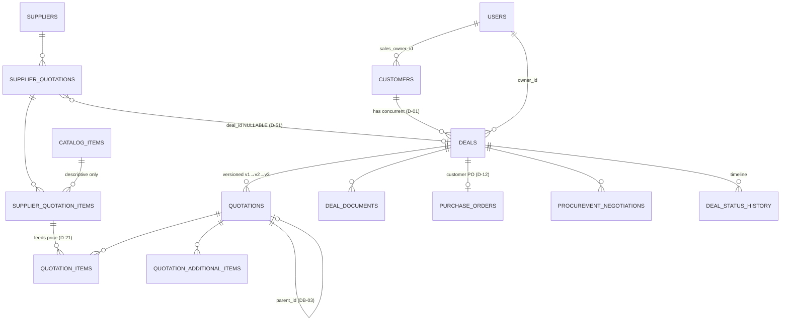

# Database Design

Derived from the specifications — **this file is not a source.** Where it and
`docs/CRM_Documentation_EN.md` disagree, the specification wins and this file is
the defect.

Its purpose is to hold the whole schema in one place before migrations are
written, which is step 2 of the module template in `MVP_Build_Plan_EN.md §1`
("Table and relationship design", before "Migration").

## How to read the markings

| Mark | Meaning |
|---|---|
| 📗 | **Documented.** Columns come from a named specification section. |
| 📙 | **Inferred.** The specification names the table but not its columns. These are proposals — **each needs approval before it is built**, per Change Discipline. |

Of the 31 tables the specifications name, **8 have documented columns**. The
other 23 are inferred. That gap is the single most useful thing this document
surfaces: it is a list of decisions nobody has made yet.

---

## 1. Rules that apply to every business table

From `§4.8`. These are not optional and not per-table.

| # | Rule |
|---|---|
| `DB-01` | Soft delete — **no physical `DELETE`** |
| `DB-02` | Audit columns: `created_by` · `created_at` · `updated_by` · `updated_at` |
| `DB-03` | Versioning via `parent_id` + `version` (quotations and reports) |
| `DB-04` | Foreign keys and constraints enforced **at the database level** |
| `DB-05` | Enum tables, never hard-coded enums |
| `DB-06` | Money carries `amount` · `currency` · `fx_rate_at_time` · `base_amount` |
| `DB-07` | **`Decimal`/NUMERIC for money — `Float` forbidden** |
| `DB-08` | Timestamps stored UTC, displayed in user time |
| `DB-09` | Indexes on: customer · owner · deal status · dates · entity codes |
| `DB-10` | Partitioning for high-volume tables: audit · notifications |
| `DB-11` | Transactions for any operation touching more than one table |
| `DB-12` | **Optimistic locking on quotations** |
| `DB-13` | Fully managed migrations — no manual schema edits |

**Infrastructure tables are exempt.** `cache`, `cache_locks`, `jobs`,
`job_batches`, `failed_jobs`, `sessions`, `migrations` are Laravel's plumbing —
soft-deleting a cache row is meaningless. `DB-01`/`DB-02` apply to business
tables only.

### The standard column block

Every business table carries these unless stated otherwise:

```sql
id           UUID PRIMARY KEY         -- D-61, time-ordered (Str::orderedUuid)
created_by   UUID REFERENCES users(id)
created_at   TIMESTAMPTZ NOT NULL
updated_by   UUID REFERENCES users(id)
updated_at   TIMESTAMPTZ NOT NULL
deleted_at   TIMESTAMPTZ NULL         -- DB-01
```

---

## 2. Core entity map 📗

From `§4.1`. This is the shape the whole system hangs off.



Three relationships carry documented weight and are easy to get wrong:

- **`SUPPLIER_QUOTATIONS.deal_id` is nullable** (`D-51`). A supplier offer is a
  standalone, reusable entity. Making it required breaks the module.
- **Prices live on `SUPPLIER_QUOTATION_ITEMS`, never on `CATALOG_ITEMS`**
  (`D-21`). The catalog is descriptive.
- **`QUOTATIONS.parent_id` self-reference** (`DB-03`, `D-08`). Partial, Counter
  and Returned each create a **full copy**, not an in-place edit.

---

## 3. Module 0 — Foundation

### `files` 📙 · `§17`

Documented: 10 MB configurable limit (`D-39`), allowed types PDF/JPG/PNG/WEBP/
DOCX/XLSX (`D-40`), true MIME validation, virus scan, UUID naming with the
original name kept in the database, path
`/{year}/{month}/{entity_type}/{entity_id}/{uuid}.ext` outside the web root,
permission inherited from the parent entity (`D-38`).

| Column | Type | Note |
|---|---|---|
| `uuid` | UUID | storage filename |
| `original_name` | VARCHAR | 📗 kept for display |
| `entity_type` | VARCHAR | 📙 polymorphic parent |
| `entity_id` | UUID | 📙 |
| `mime_type` | VARCHAR | 📗 true type, not extension |
| `size_bytes` | BIGINT | 📗 |
| `storage_path` | VARCHAR | 📗 |
| `scan_status` | VARCHAR | 📙 pending/clean/infected — `SEC-15` |
| `scanned_at` | TIMESTAMPTZ | 📙 |

> **Open:** the parent link is polymorphic here because attachments hang off
> deals, supplier quotations, purchase orders, reports and visits. The
> specification does not say how. See Q-2.

### `audit_log` 📗 · `§14.8`

Columns are documented: user · event · entity · old value · new value ·
timestamp · IP · device, plus correlation ID from `Coding_Standards §10`.

| Column | Type | Note |
|---|---|---|
| `user_id` | BIGINT | actor |
| `event` | VARCHAR | `SELF_APPROVAL`, `LOGIN_AS`, … (`§3.12` rule 4) |
| `entity_type` · `entity_id` | VARCHAR · BIGINT | subject |
| `old_values` · `new_values` | JSONB | |
| `ip_address` · `device` | INET · VARCHAR | |
| `request_id` · `correlation_id` | VARCHAR | |
| `created_at` | TIMESTAMPTZ | |

> **Immutable and retained permanently** (`D-30`, `AUD-03`). No `updated_at`, no
> `deleted_at` — those columns would imply it can change. Partitioned (`DB-10`).

---

## 4. Module 1 — Identity & RBAC 📙

The specification names `users` · `roles` · `permissions` · `role_permissions` ·
`user_sessions` but gives no columns. What **is** documented are the behaviours
the columns must support:

| Requirement | Implies |
|---|---|
| `D-28` 8-char password, letters + numbers | `password` (Argon2/bcrypt) |
| `SEC-03` lock after 5 failures | `failed_login_count`, `locked_at` |
| `D-29` 8-hour idle session | `user_sessions.last_activity_at` |
| `D-34` deactivate, never delete | `is_active` **and** `deleted_at` |
| `§3.1` eight roles | `role_id` |
| `§3.12` rule 6 Super Admin hidden | `is_hidden` or a role flag |
| `SEC-05` active device list, force logout | `user_sessions` with device/IP |
| `SEC-07` `resource.action.scope` | `permissions.resource/action/scope` |

> ⚠️ **Laravel's default `users` table meets none of this.** It has no
> `deleted_at`, no `created_by`/`updated_by`, no `is_active`, no `role_id`. It
> is replaced in Module 1, not extended.

**`permissions`** must express `resource.action.scope` as data, not code
(`SEC-07`). Scopes are the five documented values: `Own` · `Team` · `All` ·
`Out` · `Asgn`.

---

## 5. Module 2 — Settings & Currencies 📙

`settings` · `currencies` · `fx_rates` · `enum_lists` · `system_limits`.

Documented behaviours:

- **`currencies` carries a rounding unit per currency** (`D-52`): EGP `1`,
  USD `0.01`, EUR `0.01` — configurable.
- **`fx_rates` keeps history** (`§13` screen 5). Editing a rate preserves the
  old row and writes an audit entry. Rates are captured onto quotations at
  creation and **never recomputed** (`D-09`).
- **`enum_lists`** holds sectors · units · service types · delivery terms
  (`DB-05`). Adding a sector must appear in the customer form **without a
  deployment**.
- **`system_limits`**: stale-deal threshold (`D-17`) · daily report deadline ·
  approval SLA · weekly review window · max file size (`D-39`).

---

## 6. Module 3 — Customers 📗 `§4.2`

| Column | Note |
|---|---|
| `name` | required |
| `customer_status` | **derived, never entered** (`D-49`, `§4.5`) |
| `sector_id` | → `enum_lists` |
| `region` | free text with suggestions (`D-20`) |
| `contact_person` | single contact (`D-18`) |
| `phone` · `phone2` · `whatsapp` · `email` | |
| `sales_owner_id` | → `users`; TL/Manager may change |
| `start_date` | drives "years of dealing" |
| `notes` | includes communication history (`D-16`) |
| `is_archived` | manual archive, Manager + TL only |
| `is_incomplete` | imported with missing fields (`D-31`) |

**`customer_status` derivation** (`§4.5`) — first match wins:

| # | Condition | Status |
|---|---|---|
| 1 | any deal reached `Won` or beyond, ever | **Customer** — permanent |
| 2 | active deal, activity newer than stale threshold | Prospect |
| 3 | active deal but stale · or quotation `Expired` unanswered | No Response |
| 4 | all deals `Lost` | Deal Not Completed |
| 5 | registered, no deals | Prospect |

Recalculated on every deal status change **and** by nightly job `J-02`.

`import_batches` 📙 — supports the incomplete-import flow (`D-31`).

---

## 7. Module 4 — Catalog & Suppliers 📗 `§7.1`, `§7.3`

### `suppliers`

`name` · `type` (supplier/distributor) · `color_rating` (green/yellow/red/white,
set manually by any employee — `D-19`) · `phone` · `contact_person` ·
`has_open_account`.

### `catalog_items`

**Descriptive only — no prices** (`D-21`). Two kinds:

| Product | Service |
|---|---|
| product code · name · category · unit · description · is_active | service type · description · providing team · is_active · notes |

---

## 8. Module 5 — Deals 📗 `§4.3`

| Column | Note |
|---|---|
| `code` | `DL-2026-0001` (`§4.7`) |
| `customer_id` | |
| `title` | short request description |
| `source` | Outlook/WhatsApp · outdoor visit · employee entry |
| `service_type` | product · service |
| `status` | the 12 documented statuses (`§4.4`) |
| `owner_id` | assigned sales employee |
| `approval_status` | Pending · Approved · Rejected |
| `rejection_reason` | mandatory on rejection |
| `last_activity_at` | drives stale calculation (`D-17`) |

`deal_status_history` 📙 — the timeline. `§4.4` documents its content: old
status · new status · who · when.

---

## 9. Module 6 — Supplier Quotations 📗 `§7.2`

`code` (`SQ-2026-0001`) · `supplier_id` · **`deal_id` NULLABLE** (`D-51`) ·
`total_price` · `currency` · `offer_date` · `valid_until` · `pdf_file` ·
`notes` · `entered_by`.

`supplier_quotation_items` 📗 — product · **price** · quantity. This is where
supplier prices live (`D-21`).

---

## 10. Module 7 — Customer Quotations 📗 `§6.2`, `§5`

The most constrained table in the system.

| Group | Columns |
|---|---|
| Core | `code` (`QT-`) · `deal_id` · `customer_id` · `quotation_date` · `valid_until` · `status` (9 — `§6.1`) |
| Financial | `currency` · `default_margin` · `discount_percent` · `tax_percent` |
| Totals | `subtotal` · `discount_amount` · `net_amount` · `additional_total` · `tax_base` · `tax_amount` · `total_before_round` · `final_total` · **`rounding_diff`** |
| Terms | `payment_terms` (free text — `D-26`) · `warranty` · `delivery` · `show_delivery_terms` |
| Versioning | `version` · `parent_id` · `rejection_reason` |
| Tracking | `created_by` · `sent_at` · `is_self_approved` (`D-50`) |
| Concurrency | `version_token` for `If-Match` (`DB-12`, `API-12`) |

**`quotation_items`** 📗 `§5.1`: `unit_cost` · `unit_cost_base` ·
`margin_percent` · `unit_price` · `line_total` · `line_cost`.

> Every money column is `NUMERIC`, never `float` (`DB-07`). `rounding_diff` is
> **stored, not computed on read** (`D-06`).

---

## 11. Modules 10–13 📙

| Table | Documented |
|---|---|
| `purchase_orders` 📗 `§4.6` | `po_number` (system) · `customer_po_reference` (free text) · `po_date` · attachment. **Both numbers searchable.** |
| `procurement_negotiations` | `§5.5`: saving = old cost − new cost; failed attempts need a reason |
| `visits` · `visit_areas` | `§9` Flow 2: exactly **three mandatory fields** — company name, contact person, outcome |
| `reports` 📗 `§11.3` | code · title · type · **date range (mandatory)** · author · dates · status · notes · attachments |
| `report_recipients` · `report_versions` | `§11.4` lifecycle; acknowledged is permanently read-only |

---

## 12. Open questions this exercise surfaced

None of these are answered anywhere in the specifications. They need decisions
before the migrations they affect.

| # | Question | Blocks |
|---|---|---|
| ~~Q-1~~ ✅ | ~~`BIGSERIAL` or `UUID`?~~ **Closed by `D-61`: UUID, time-ordered.** One key rather than a numeric key plus a public UUID. | — |
| **Q-2** | Attachments hang off deals, supplier quotations, POs, reports and visits. Polymorphic `files` table, or a join table per parent? | Module 0 |
| **Q-3** | Is `audit_log` partitioned by month or by year? `DB-10` says partition, not how. | Module 0 |
| **Q-4** | Does `users` keep Laravel's `email_verified_at`? `SEC-01` forbids public sign-up, so nothing verifies an email at registration. | Module 1 |
| **Q-5** | `enum_lists` as one table with a `type` column, or one table per list? `DB-05` says enum tables, plural. | Module 2 |
| **Q-6** | Deal statuses (`§4.4`) — managed enum table like the others, or a constrained column? `DB-05` implies a table. | Module 5 |

---

## 13. What is not designed yet

`user_sessions` · `deal_documents` · `quotation_additional_items` ·
`user_term_suggestions` · dashboard summary tables (`J-09`) · notification
tables (post-MVP).

These are named in the build plan but have neither documented columns nor a
pressing need before their module. They are listed so nobody assumes the schema
is complete.
